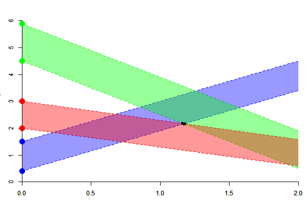

## Goal 

- Implement Ciszewski & Hannig's sampler of the fiducial distributino for normal linear mixed models

- *Why Julia ?* 

  - The algorithm is computationnaly intensive
  
  - It requires a high numerical precision; we hope the `BigFloat` type in Julia will achieve this precision 

---

## Problem addressed in these slides 

- These slides only address one part of the algorithm: the sampling of 
random polyhedra in the Euclidean space 

- This is the point requiring high numerical precision, because the 
polyhedra are sequentially sampled and become smaller and smaller and smaller...

- I'm not a Julia specialist; these slides should firstly help me to request some help

--- &twocolcustomwidth 

## Polyhedra construction: overview 

*** {name: left, width: "33%"}

- *Data:* Some pairs of points are given on the $y$-axis

- *Sampling:* Some ribbons issued from these points are sampled at random 

- *Computation:* The polyhedron at the intersection of the ribbons

*** {name: right, width: "63%"}

--- &twocolcustomwidth 

## Polyhedra construction: algorithm 

*** {name: left, width: "33%"}

- *Step 1:* the slopes of the first two pairs of lines are sampled without restriction

- *Step 2:* the polyhedron is computed

- *Step 3:* the slope of the next pair is sampled in a constrained range, assuring there's an intersection

- *Step 4*: the polyhedron is  updated

- *Repeat* steps 3 and 4

*** {name: right, width: "63%"}

--- &twocolcustomwidth

## Line and polyhedron representation 

  - A line has a ''type'': upper or lower
  
  - A line has $0$, $1$ or $2$ intersections with the active polyhedron

*** {name: left, width: "60%"}

*** {name: right, width: "40%"}

- Only lines having two intersections are kept

- A polyhedron is represented by a set of such lines

--- &twocolcustomwidth

## Line and polyhedron in Julia  

I will firstly try to deal with lines and polyhedra using these types and macros:

*** {name: left, width: "60%"}

<pre><code class="r" style="font-size:66%">type Line
        a::Float64   # intercept
        b::BigFloat  # slope
        x1::BigFloat # x-coordinate of first vertice
        y1::BigFloat # y-coordinate of first vertice
        x2::BigFloat # x-coordinate of second vertice
        y2::BigFloat # y-coordinate of second vertice
        typ::Bool    # type of the line (true:upper, false:lower)
end
</code></pre>

*** {name: right, width: "40%"}

<pre><code class="r" style="font-size:66%">type Poly
        a::Vector{Float64}
        b::Vector{BigFloat}
        x1::Vector{BigFloat}
        y1::Vector{BigFloat}
        x2::Vector{BigFloat}
        y2::Vector{BigFloat}
        typ::Vector{Bool}
end
</code></pre>

*** =fullwidth

<pre><code class="r" style="font-size:66%">macro addLine(poly, line)
        for op = (:a, :b, :x1, :y1, :x2, :y2, :typ)
          @eval $poly.$op = [$poly.$op, $line.$op]
        end
end
</code></pre>

<pre><code class="r" style="font-size:66%">macro removeLine(poly, index)
    for op = (:a, :b, :x1, :y1, :x2, :y2, :typ)
        @eval splice!($poly.$op, $index)
    end
end
</code></pre>

--- 

## Computing the range and intersection 

Recall the two steps, when a particle and a new pair of starting points 
on the $y$-axis is given:

- Calculate the range of the possible slope of the new ribbon

- Generate the new ribbon and compute the new particle

--- 

## Computing the range

Two different situations are considered for the range calculation:

